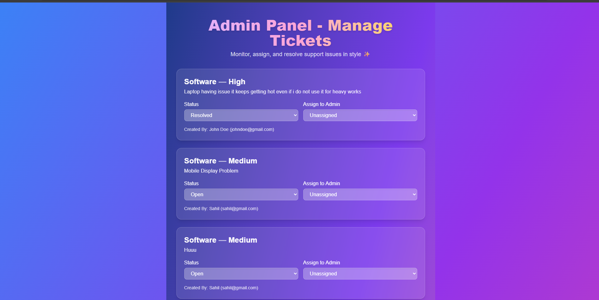
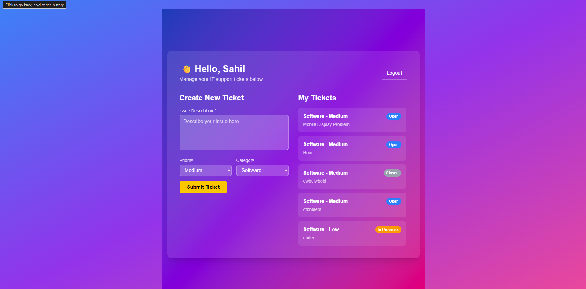
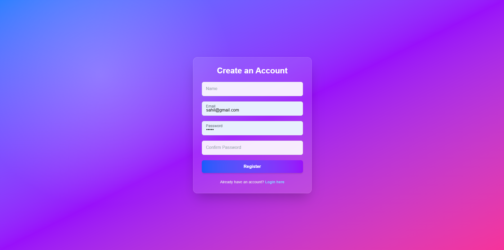
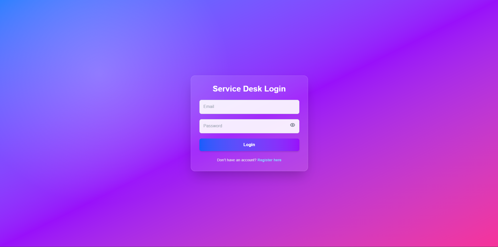

# 🛠️ Service Desk Application (SDA)

A full-stack **MERN** (MongoDB, Express.js, React.js, Node.js) based Service Desk Application that allows users to raise and manage service tickets. Admins can view, assign, and resolve tickets efficiently. This project focuses on delivering a seamless user experience with secure authentication, real-time updates, and a responsive UI.

---


---
## 🚀 Features

### 👤 User Features
- ✅ Register and login securely using JWT.
- 📝 Raise tickets by providing issue details, priority, and category.
- 📊 Track ticket status (Open, In Progress, Resolved).
- 🔄 Update and provide additional information if required.

### 👨‍💼 Admin Features
- 📋 View all tickets in the system.
- 🧑‍🔧 Assign tickets to staff or update statuses.
- 💬 Add internal comments or updates to tickets.

### 🌐 UI/UX
- Built with **React** and **Material UI** for a modern interface.
- Responsive design for all screen sizes.
- Role-based rendering and routing (admin vs user).

## 🗂️ Project Structure

```
SDA/
├── backend/
│   ├── middleware/
│   │   └── authMiddleware.js
│   ├── models/
│   │   ├── Ticket.js
│   │   └── User.js
│   ├── routes/
│   │   ├── ticketRoutes.js
│   │   └── userRoutes.js
│   ├── .env
│   ├── server.js
│   └── vercel.json
│
├── frontend/
│   ├── public/
│   ├── src/
│   │   ├── assets/
│   │   ├── contexts/
│   │   │   └── AuthContext.jsx
│   │   ├── pages/
│   │   │   ├── AdminPanel.jsx
│   │   │   ├── Dashboard.jsx
│   │   │   ├── LoginPage.jsx
│   │   │   ├── RegisterPage.jsx
│   │   │   └── TicketDetail.jsx
│   │   ├── api.jsx
│   │   ├── App.jsx
│   │   ├── App.css
│   │   ├── main.jsx
│   │   └── index.js
│   ├── .env
│   ├── .gitignore
│   └── README.md
```
## 📷 Screenshots

### 🔐 Login Page


### 📋 Ticket List View


### 📝 Ticket Details


### 👤 Admin Dashboard



## ⚙️ Tech Stack

| Layer     | Technology                     |
|-----------|--------------------------------|
| Frontend  | React.js, Material-UI, Axios   |
| Backend   | Node.js, Express.js            |
| Database  | MongoDB, Mongoose              |
| Auth      | JWT, Bcrypt.js                 |
| Hosting   | Vercel / Render / Localhost    |

---
## 🧱 Application Architecture


### 🔄 Architecture Breakdown

- **Front-end (ReactJS)**: Renders UI components and makes API calls to the backend.
- **Back-end (NodeJS + ExpressJS)**: Handles RESTful API requests and routes them to appropriate logic.
- **Database (MongoDB)**: Stores user information, tickets, and other app data using collections and documents.


  ## 🧱 API Endpoints
  
  ### 🧑‍💼 USER ROUTES

| **ENDPOINT**      | **METHOD** | **PROTECTED** | **ROLE**    | **API PATH**              | **DESCRIPTION**                                  |
|-------------------|------------|----------------|-------------|----------------------------|--------------------------------------------------|
| REGISTER          | `POST`     | ❌             | `public`    | `/api/users/register`     | Register a new user with name, email, password   |
| LOGIN             | `POST`     | ❌             | `public`    | `/api/users/login`        | Login with email and password, returns JWT token |
| GET_PROFILE       | `GET`      | ✅             | `user/admin`| `/api/users/profile`      | Fetch profile of currently logged-in user        |
| GET_ALL_USERS     | `GET`      | ✅             | `admin`     | `/api/users/`             | Admin fetches a list of all registered users     |


### 🎫 TICKET ROUTES

| **ENDPOINT**               | **METHOD** | **PROTECTED** | **ROLE**      | **API PATH**                    | **DESCRIPTION**                                          |
|----------------------------|------------|----------------|----------------|----------------------------------|----------------------------------------------------------|
| CREATE_TICKET              | `POST`     | ✅             | `user`         | `/api/tickets/`                 | Create a new support ticket                              |
| GET_MY_TICKETS            | `GET`      | ✅             | `user`         | `/api/tickets/mytickets`        | Retrieve all tickets created by the logged-in user       |
| GET_TICKET_DETAILS         | `GET`      | ✅             | `user/admin`   | `/api/tickets/:id`              | Fetch detailed ticket info (only if authorized)          |
| ADD_TICKET_UPDATE          | `POST`     | ✅             | `user/admin`   | `/api/tickets/:id/updates`      | Add a comment/update to a ticket                         |
| GET_ALL_TICKETS            | `GET`      | ✅             | `admin`        | `/api/tickets/`                 | Admin fetches all tickets from all users                 |
| ASSIGN_TICKET              | `PUT`      | ✅             | `admin`        | `/api/tickets/:id/assign`       | Assign a ticket to an admin and change status to "In Progress" |
| UPDATE_TICKET_STATUS       | `PUT`      | ✅             | `admin`        | `/api/tickets/:id/status`       | Update a ticket's status to Open, In Progress, Resolved, or Closed |


## 🧪 Installation & Setup

Follow the steps below to get the Service Desk Application up and running locally on your machine.

---

### 🛠 Prerequisites

- [Node.js](https://nodejs.org/) (v16 or higher recommended)
- [MongoDB](https://www.mongodb.com/) (local or cloud)
- [npm](https://www.npmjs.com/) or [Yarn](https://yarnpkg.com/)

---

### 📦 Clone the Repository

```bash
git clone https://github.com/Satyam23092003/service-desk-app.git
cd service-desk-app
```

## 🙌 Acknowledgements

- Special thanks to **Celebal Technologies** for providing this amazing learning opportunity.
- Thanks to my mentor and peers for constant guidance and support.

---
